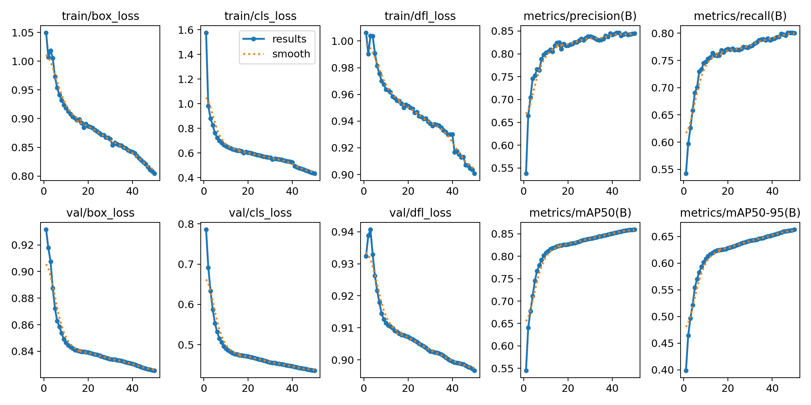
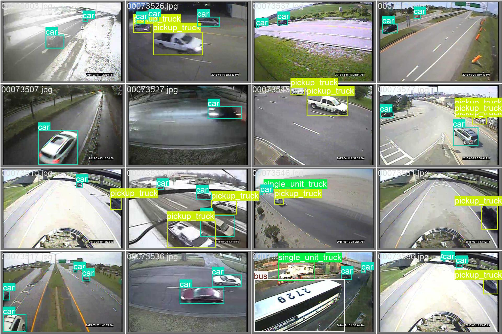
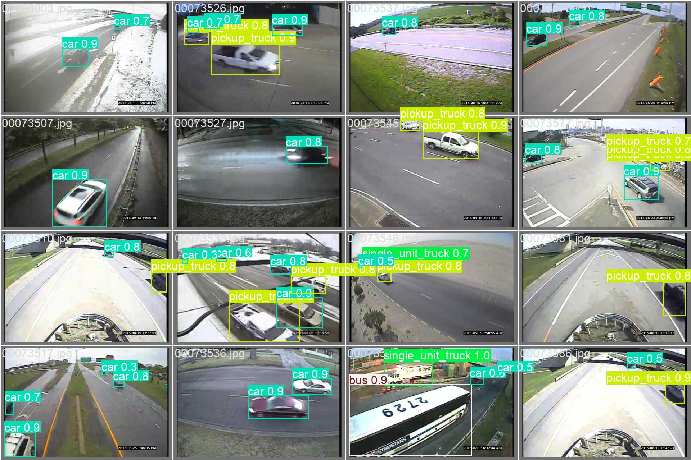

# YOLO-MIO-TCD: Traffic Object Detection
This project uses the YOLOv8 object detection model trained on the MIO-TCD dataset to detect various types of vehicles in traffic surveillance footage. It's built for smart traffic management systems and supports both classification and localization of traffic objects.

## Contents
- Trained YOLOv8 models (yolov8n.pt, yolo11n.pt)
- Dataset folders: MIO-TCD Classification, MIO-TCD Localization
- Training and inference scripts
- The best and last weights are present in runs/detect/train8/weights

## Usage
- Train: python yolo_train.py
- Inference: python yolo.py --weights yolov8n.pt --source path/to/image_or_video

## Dataset

This project uses the [MIO-TCD Dataset](https://tcd.miovision.com/).

You can download the datasets from the official website:

- 🔗 *Classification Dataset*: [Download here](https://tcd.miovision.com/challenge/dataset.html)
- 🔗 *Localization Dataset*: [Download here](https://tcd.miovision.com/challenge/dataset.html)

After downloading, place the folders in the root project directory

## Model Performance

| Metric              | Value |
| ------------------- | ----- |
| *mAP\@0.5*        | 86.0% |
| *mAP\@0.5:0.95*   | 66.4% |
| *Precision*       | 84.4% |
| *Recall*          | 80.1% |
| *F1-Score*        | 86.0% |
| *Training Epochs* | 50    |

## Training Metrics

## Sample Outputs
Input Image

Predicted classes

## Credits
- Ultralytics YOLOv8
- MIO-TCD Dataset
